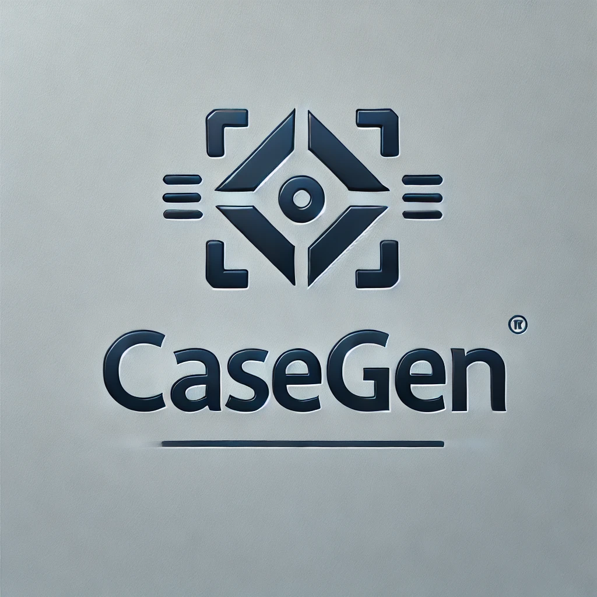

<!--
 * @Author: lihaitao
 * @Date: 2025-02-23 17:40:07
 * @LastEditors: Do not edit
 * @LastEditTime: 2025-02-23 18:02:52
 * @FilePath: /lht/GitHub_code/CaseGen/README.md
-->
<div align="center">

<h1> CaseGen: A Benchmark for Multi-Stage Legal Case Documents Generation </h1>
</div>


<p align="center">
    📖 <a href="README_zh.md">   中文</a> |📃 <a href="README.md">English</a> |
<!--     📚 <a href="https://huggingface.co/datasets/CSHaitao/CaseGen">Data</a>  -->
</p>


Welcome to **CaseGen**, a benchmark designed to evaluate large language models (LLMs) in the generation of legal case documents.

## Introduction

**CaseGen** is a benchmark designed to evaluate large language models (LLMs) in the generation of legal case documents in the Chinese legal domain. The dataset includes 500 real-world legal case instances, each structured into seven sections: Prosecution, Defense, Evidence, Events, Facts, Reasoning, and Judgment. It supports four key tasks: drafting defense statements, writing trial facts, composing legal reasoning, and generating judgment results.

This repository contains both the dataset and the code for evaluating the performance of LLMs in generating legal case documents. It provides a multi-stage generation task framework and an automated evaluation pipeline using LLMs as evaluators.


## Task Description

CaseGen includes four key tasks:
1. **Drafting Defense Statements**: Respond to the prosecution’s claims based on evidence.
2. **Writing Trial Facts**: Construct trial facts by verifying the true course of events.
3. **Composing Legal Reasoning**: Analyze the case facts and apply legal principles for the court's reasoning.
4. **Generating Judgment Results**: Formulate the final ruling based on trial facts and legal reasoning.


## Data

The data was collected from publicly available legal resources, with a strong emphasis on maintaining data integrity and quality. The case documents have been pre-processed and annotated by legal experts. Evidence details are annotated for completeness, and the data is formatted in JSON for ease of use.
An example of a case is:
```
{
    "id": 0,
    "title": " ",
    "full_text": " ",
    "defense": " ",
    "fact": " ",
    "reasoning": " ",
    "event": { },
    "evidence": { }
}
```

## Code

The code in this repository allows users to: 
- Generate case documents**: Using various LLMs to simulate legal case document drafting tasks. 
- Evaluate model performance**: Using a custom-built LLM-as-a-judge evaluation framework, which includes task-specific scoring metrics.

### Generating Legal Documents

In this project, predefined templates are used to generate legal documents. Here are the steps to follow:

1. **Prepare Input Data**  
   Place the input data in the `data/` directory, ensuring the data format meets the required specifications.

2. **Run the Generation Command Script**  
   Use the following command to run the generation script and specify the task type (e.g., defense, fact, reasoning, judgment):
   ```bash
   python generate/make_prompt.py <task_name>
   ```
   If no task name is specified, all tasks will be processed.

The generated prompts will be saved in the `generate/prompt/` directory with the filename format `<task_name>_generate_prompt.json`.

3. **Call the LLM to Generate Documents** 
    After generating the prompts, use the following command to call llm_generate.py to generate the legal documents.
    ```bash
    python generate/llm_generate.py <model_name> <API_KEY> <task_name>
    ```

    - `<model_name>`:  The name of the model to be used, e.g., `glm-4-flash`.
    - `<API_KEY>`:  The API key.
    - `<task_name>`: The task name (optional), such as defense, fact, reasoning, judgement. If no task name is specified, all tasks will be processed.
    The generated legal documents will be saved in the `generate/generated_data/<model_name>/` directory with the filename `<task_name>.json`.

### Evaluating Legal Documents
    In this project, predefined templates are used to evaluate generated legal documents. Follow these steps:

1. **Prepare the Generated Documents**
    Place the generated documents in the `generate/generated_data/<model_name>/` directory, with filenames in the format `<task_name>.json`, ensuring the data format meets the required specifications.

2. **Run the Evaluation Command Script**
    Use the following command to run the evaluation script and specify the task type (e.g., defense, fact, reasoning, judgment):
    ```bash
    python eval/make_prompt.py <model_name> <task_name>
    ```
    If no task name is specified, all tasks will be processed.

3. **View the Generated Prompts**
    The generated prompts will be saved in the `eval/prompt/<model_name>/` directory with the filename format `<task_name>_eval_prompt.json`.

4. **Call the LLM to Evaluate Documents**
    After generating the prompts, use the following command to call `llm_eval.py` to evaluate the legal documents:
    ```bash
    python generate/llm_eval.py <model_name> <API_KEY> <task_name>
    ```
    The evaluation results will be saved in the `eval/llm_eval_result/<model_name>/` directory with the filename `<task_name>.json`.
5. **Process the Evaluation Results**
    Use the llm_eval_handle.py script to process the evaluation results. The main functions of this script include:
    ```
    python eval/llm_eval_handle.py <model_name> <task_name>
    ```
    If no task name is specified, all tasks will be processed. 
    - Extract key information from the evaluation results and format it as structured data. 
    - Calculate the average values and distribution of scores for easy analysis of the generated documents' quality. 
    - Save the processed results to an Excel file for further viewing and analys

6. **Evaluate Using BLEU, ROUGE, and BERTScore**
    Run the evaluation script to calculate the BLEU, ROUGE, and BERTScore metrics between the generated documents and reference documents:
    ```bash
    python eval/bleu_rouge_bert_eval.py <model_name> <task_name>
    ```
    The evaluation results will be saved in the `eval/eval_result/<model_name>/` directory with the filename `<task_name>_eval_result.json`.

## License
CaseGen is released under the **CC BY-NC-SA 4.0** license. It is available for non-commercial academic use. Commercial use requires additional authorization.
