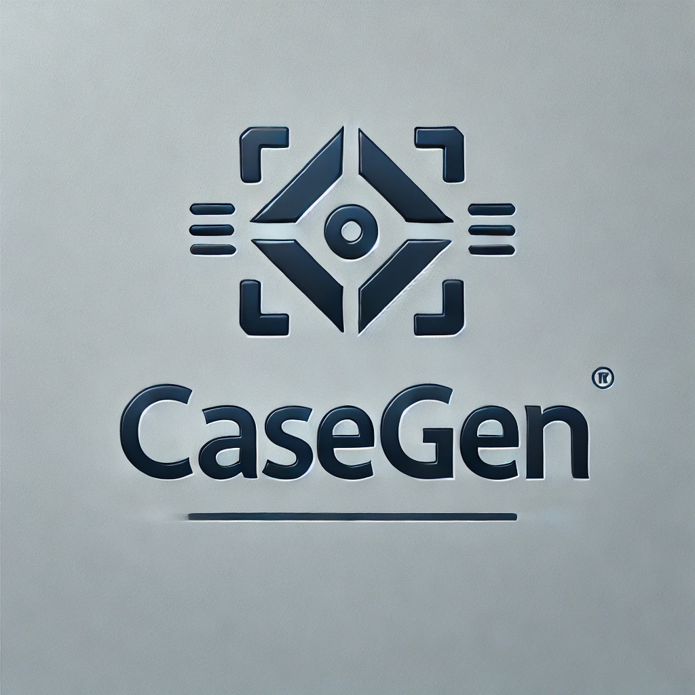

<div align="center">

<h1> CaseGen: A Benchmark for Multi-Stage Legal Case Documents Generation </h1>
</div>


<p align="center">
    📖 <a href="README_ZH.md">   中文</a> | <a href="README.md">English</a>
</p>

欢迎来到 **CaseGen**，这是一个用于评估大模型在生成法律文书方面表现的基准。


## 介绍
**CaseGen** 是一个用于评估大规模语言模型（LLMs）在中国法律领域生成法律案件文书的基准。该数据集包含了500个真实的法律案件实例，每个案例分为七个部分：起诉状、答辩状、证据、事件、事实、法院说理和判决结果。它支持四个关键任务：撰写答辩状、撰写审理事实、撰写法院说理和生成判决结果。

本仓库包含了数据集和评估LLMs在生成法律案件文书方面表现的代码。它提供了一个多阶段生成任务框架，并使用LLMs作为评估器来实现自动化评估流程。

## 任务描述
本项目的总体任务是生成并评价法律文书，确保生成的文书符合法律规范，并能够有效支持法律分析和裁判过程。生成的法律文书，包括以下四个主要类型：

1. **答辩状 (Defense)**  
   生成针对起诉状的答辩状，要求清晰、全面地回应原告的指控，并通过法律论证和证据支持辩护立场。

2. **审理事实查明 (Fact)**  
   根据起诉状、答辩状和相关证据，综合所有证据中的事实描述，生成法律文书中的"审理事实查明"段落，确保内容全面、表述准确。

3. **判决说理 (Reasoning)**  
   根据起诉状、答辩状和审理查明的事实，撰写法律文书的判决说理段落，进行全面的法律分析和推理。

4. **判决结果 (Judgement)**  
   根据审理事实和判决说理，撰写详细的判决结果，确保引用相关法律条文支持裁判结论，逻辑严密、语言规范。

## 数据

数据来自公开可用的法律资源，重点保证数据的完整性和质量。案件文书经过法律专家的预处理和注释。证据的详细信息经过注释，确保完整性，并且数据已格式化为JSON，以便于使用。

以下是一个示例：
```
{
    "id": 0,
    "title": " ",
    "full_text": " ",
    "defense": " ",
    "fact": " ",
    "reasoning": " ",
    "event": { },
    "evidence": { }
}
```


## 代码使用

### 生成文书
在本项目中，可以使用预定义的模板来生成法律文书。以下是如何使用步骤：

1. **准备输入数据**  
   将输入数据放在 `data/` 目录下，确保数据格式符合要求。

2. **运行生成指令脚本**  
   使用以下命令运行生成脚本，指定要处理的任务类型（如 defense, fact, reasoning, judgement）：
   ```bash
   python generate/make_prompt.py <task_name>
   ```
   如果不指定任务名称，将处理所有任务。

3. **查看生成的指令**  
   生成的指令将保存在 `generate/prompt/` 目录下，文件名格式为 `<task_name>_generate_prompt.json`。

4. **调用 LLM 生成文书** 
    在生成指令后，可以使用以下命令调用 `llm_generate.py` 来生成法律文书：
    ```bash
    python generate/llm_generate.py <model_name> <API_KEY> <task_name>
    ```
    - `<model_name>`: 要使用的模型名称，例如 `glm-4-flash`。
    - `<API_KEY>`:  API 密钥。
    - `<task_name>`: 要处理的任务名称（可选），如 `defense`, `fact`, `reasoning`, `judgement`。
    如果不指定任务名称，将处理所有任务。
    生成的法律文书将保存在 `generate/generated_data/<model_name>/` 目录下，文件名为 `<task_name>.json`。

### 评价文书
在本项目中，可以使用预定义的模板来评价生成的法律文书。以下是如何使用这些模板的步骤：

1. **准备生成的文书**  
   将生成的文书放在 `generate/generated_data/<model_name>/` 目录下，文件名为 `<task_name>.json`，确保数据格式符合要求。

2. **运行评价指令脚本**  
   使用以下命令运行评价脚本，指定要处理的任务类型（如 defense, fact, reasoning, judgement）：
   ```bash
   python eval/make_prompt.py <model_name> <task_name>
   ```
   如果不指定任务名称，将处理所有任务。

3. **查看生成的指令**  
   生成的指令将保存在 `eval/prompt/<model_name>/` 目录下，文件名格式为 `<task_name>_eval_prompt.json`。

4. **调用 LLM 评价文书**  
   在生成指令后，可以使用以下命令调用 `llm_eval.py` 来评价法律文书：
   ```bash
   python generate/llm_eval.py <model_name> <API_KEY> <task_name>
   ```
   - `<model_name>`: 要被评价的模型名称，例如 `glm-4-flash`（用于定位输入文件）。
   - `<API_KEY>`: API 密钥。
   - `<task_name>`: 要处理的任务名称（可选），如 `defense`, `fact`, `reasoning`, `judgement`。
   如果不指定任务名称，将处理所有任务。
   评价的结果将保存在 `eval/llm_eval_result/<model_name>/` 目录下，文件名为 `<task_name>.json`。

5. **处理评价结果**  
   使用 `llm_eval_handle.py` 脚本处理评价结果。该脚本的主要功能包括：
   ```bash
   python eval/llm_eval_handle.py <model_name> <task_name>
   ```
   如果不指定任务名称，将处理所有任务。
   - 从评价结果中提取关键信息，并将其格式化为结构化数据。
   - 计算各项评分的平均值和分布情况，便于分析生成文书的质量。
   - 将处理后的结果保存到 Excel 文件中，方便后续查看和分析。

6. **使用 BLEU、ROUGE 和 BERTScore 进行评估**  
   使用以下命令运行评估脚本，计算生成文书与参考文书之间的 BLEU、ROUGE 和 BERTScore：
   ```bash
   python eval/bleu_rouge_bert_eval.py <model_name> <task_name>
   ```
   - `<model_name>`: 要评估的模型名称，例如 `glm-4-flash`。
   - `<task_name>`: 要处理的任务名称（可选），如 `defense`, `fact`, `reasoning`, `judgement`。
   评估结果将保存在 `eval/eval_result/<model_name>/` 目录下，文件名为 `<task_name>_eval_result.json`。

通过以上步骤，可以评价生成的法律文书，并获取详细的评分和分析结果。


## License
CaseGen 采用 **CC BY-NC-SA 4.0** 许可证发布。它仅供非商业学术使用。商业用途需要额外授权。

